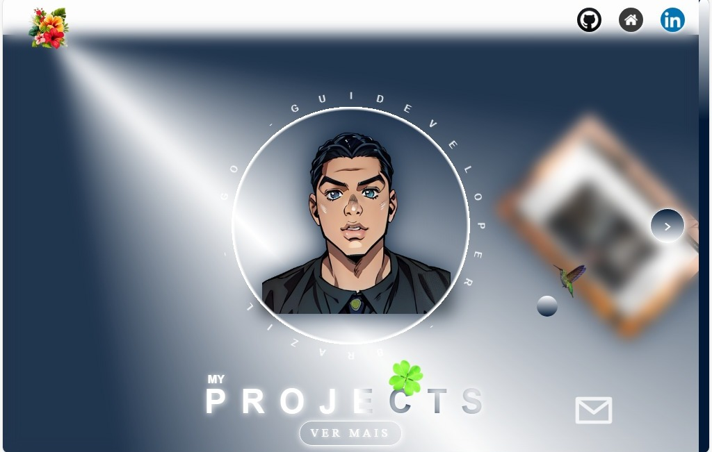

# GuiDeveloper GitHub Page

Bem-vindo ao repositório da minha página de desenvolvedor no GitHub! Este projeto é uma vitrine dos meus trabalhos e projetos. Aqui você pode explorar minhas habilidades e projetos em HTML, CSS, e JavaScript.



## Índice

* Introdução
* Estrutura do Projeto
* Instruções de Instalação
* Como Usar
* Tecnologias Utilizadas
* Contato

## Introdução

Este é o código fonte da minha página pessoal no GitHub. A página inclui um slider dinâmico, links para meus perfis em redes sociais, e um chat simples onde os visitantes podem deixar mensagens.

## Estrutura do Projeto

```sh
/
├── img/
│   ├── logo-github.jpg
│   ├── logo-home.jpg
│   ├── logo-linkedin.jpg
│   ├── saturn.png
│   └── outros arquivos de imagem
├── main/
│   ├── main.css
│   └── main.js
├── table/
│   ├── table.css
│   └── table.html
├── midia/
│   └── stylle.css
├── style.css
├── app.js
└── index.html

```
## Instruções de Instalação

### Clone este repositório

```sh
    git clone https://github.com/Guilhermefariah/Guilhermefariah.github.io
```

### Navegue até o diretório do projeto

```sh

```
### Abra o arquivo index.html no seu navegador

```sh
open index.html
```

## Como Usar

* Slider: Navegue pelos itens utilizando os botões de seta < e >.
* Áudio: A página inclui um áudio que toca automaticamente.
* Chat: Deixe uma mensagem no chat clicando no botão de envelope e preenchendo o formulário.

## Tecnologias Utilizadas

* HTML5: Estrutura da página web.
* CSS3: Estilização e layout.
* JavaScript: Funcionalidades dinâmicas, como o slider e animações.
* GitHub Pages: Hospedagem do site.

## Contato

* GitHub: Guilherme Faria
* LinkedIn: Guilherme Faria
* Email: guilhermefaria321@gmail.com

